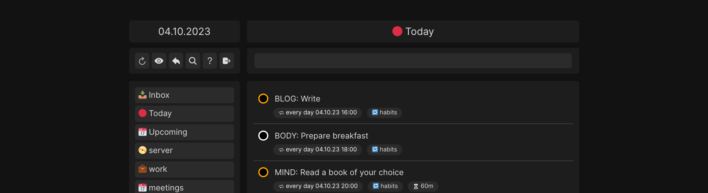
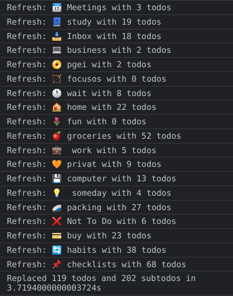

<h1 align="center">
  
  <br><br>
  Select20 - Natural Language Todo-App
  <br>
</h1>

<h4 align="center">The todo app Select20 leverages language recognition to manage tasks more efficiently. The distraction-free and blazing fast app supports offline usage and compatibility to CalDav.</h4>

<p align="center">
  <a href="#why-should-i-use-select20">Key Features</a> •
  <a href="#how-to-use">How To Use</a> •
  <a href="https://s20.lippke.li">Demo</a> •
  <a href="https://github.com/liquididea/Select20/blob/main/DEVELOPER_DOCU.md">Developer Docu</a> •
  <a href="https://raw.githubusercontent.com/liquididea/Select20/main/LICENCE">License</a>
</p>

## How to use

Online Demo: Go to https://s20.lippke.li/ and select Demo mode

OR

1. Clone the git repo

```sh
git clone https://github.com/liquididea/Select20.git
```

2. Change the passwords in the backend-laravel/.env.example --> .env file
3. Spin up Docker with <a href="https://docs.docker.com/compose/gettingstarted/">Docker Compose</a>

```sh
docker compose up
```

4. Open new console & initialize database only on the first startup

```sh
docker exec select20_backend_laravel sh -c  "php artisan migrate && php artisan jwt:secret -f && php artisan key:generate"
```

5. Restart docker compose --> `Strg + c` and `docker compose up` again

6. Open http://localhost:8081

## Why should I use Select20?

### Detects your natural language (NLP)

- p1,p2,p3,p4 --> Priority, p1 is the highest - colored red circle
- #project --> Automatically moves the todo in the correct project
- 30.12.2023 --> Full date with day.month.year - separated by dots
- 30.12 --> Short date with day.month the software assumes the current year
- 90m --> Todos can be scheduled with duration. Need for start due date.
- every mon 19:00 --> Add recurring rule with time. Weekly rhythms are possible.
- every 4 sun 10:00 --> Recurring rule on every X weeks
- - Shopping --> Star --> Checklist with sub todos that will restore on reload.
- https://example.com --> Add links and a short link is created (hover needed)


### Support for hyper dynamic todos


- autofocus creation of todos
- key data chips
  - time
  - overdue
  - checklist
  - duration
  - project
- tasks with subtasks
- auto HTML strip
- project - fuzzy search (#wor --> assigns project work)
- auto detection of URL
  - detects the first URL
  - add a url button (new tab)
- delete recurring rule / end to do forever
- auto create calendar entry
  - when due date is set
  - connect calendars with todo lists
- create todos in other projects
  - with #project
  - temp display in current project

### Plan projects like PRO


- default project: today / Upcoming / Inbox
- indentation for sub projects
- sorting
- connect calendar with todo

- todo will not crate a calendar entry if ...
  - **!nocal** expression
  - day tasks (no time)
  - no due set
  - todos with a recurring rule
- project settings synced over devices

### Security first features!

- Self-hosted - no online access needed
- Never delete a todo
- Force TLS (HTTPs) with PWA
- CSRF protection
- XSS protection
- SQL-Injection protection
- No nextcloud keys in frontend

### Fallout shelter proof syncing



- extreme caching
  - instant loading
  - update on view
  - cross device sync
- Progressive Web App
  - secure by default
  - service worker
  - installable
- Offline Support
  - toggling, editing and adding todos
  - Counter for pending changes
- Login / Register (multiple instances)

## Usage

- Start to type and use the keywords #, p1, dates, rhythm
- Shift todos between project by typing #project at the end. The todo will shifted visually on the next project change / reload
- Undo finishing todos by using the Undo-button at top right (next to reload)
- Change the connected calendar per project by using the edit button
- Add links to you todo and hover the todo to get a direct link symbol

### Roadmap

- Android Sharing
- PWA Sharing
- Grouping by date
- Attributes
- Create and rename projects
- iOS App - you can release with Ionic easily a Ionic iOS App

Not-to-do - Simplify it:

- Sub-sub-todos
- dropdowns and lots of buttons
- datepicker

## FAQ

### How to shift a todo to other project?

Edit the todo and add #project at the end and hit enter.

### How can add sub todos?

Click on the add symbol during hovering a todo.

### How can search todos?

Click on the search icon on the menu or put your cursor inside the input and press Strg + ArrowDown

### How can I see hidden projects again?

Click on the view icon

### How to change the calendar of project?

Edit the project. Select the calendar in the dropdown and safe.

### I want to restore the last todo / undo a todo

Use the back error beside the reload symbol.

### Are my todos deleted if I tick them?

Todos are only hidden. You can restore todos manually with the history or Nextcloud database.

## Why did I code this todo app?

The best todo app I tested was Todoist ... but I cannot self host the service and need to expose my private information to the government ("Cloud"). So I started to code my own with Nextcloud in the background.

## Why the app is named "Select20"

Select the 20 % of the todos that bring the most impact for your life and work. The other 80 % of todos you can archive ... and relax. The product name name Select20 is reminder: Do not finish to 1000 of todos everyday. Instead pick the impactful ones.

## License

GNU GENERAL PUBLIC LICENSE Version 2
